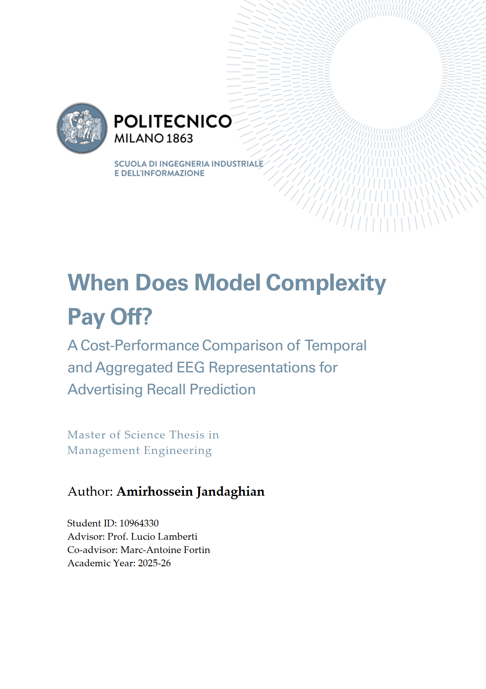

# Master's Thesis Defense Materials

This directory contains the public materials shared for my thesis defense at Politecnico di Milano (Polimi).

- **Defense Presentation:** [Jandaghian_Presentation_thesis.pdf](./Jandaghian_Presentation_thesis.pdf)

- **Thesis Report Cover:**

## Confidentiality Note

Due to NDA constraints, the full thesis report, parts of the original data assets, identifiers, and notebook-specific configuration details are intentionally excluded from this repository. As a result, these notebooks and materials are shared primarily as a transparent showcase of the analytical methodology, code structure, and workflow logic, rather than as a fully executable end-to-end package. The process remains methodologically reproducible at the design level, while protected content is withheld to preserve confidentiality obligations.

